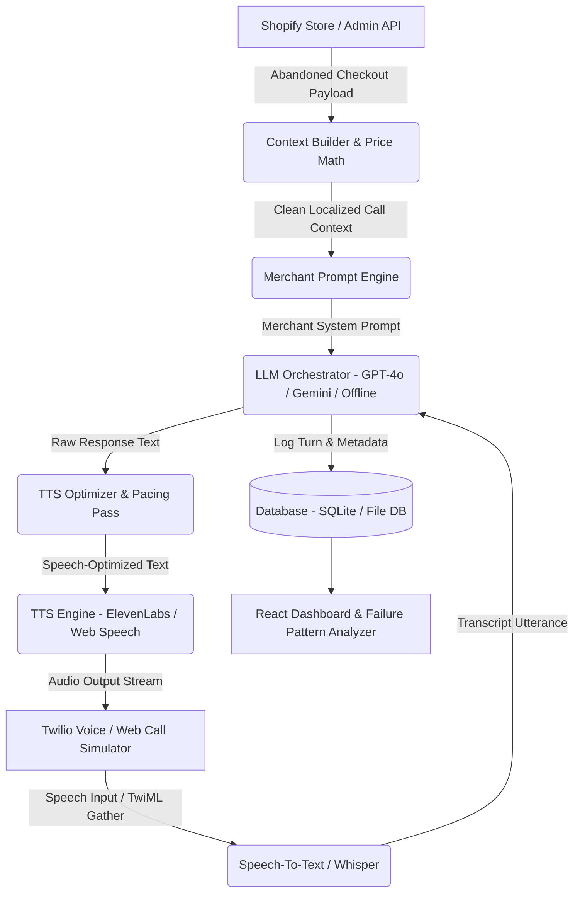

# EchoCart — AI Voice Agent for Shopify Cart Recovery & Order Confirmation

> **Enterprise Voice AI Agent Platform built to replicate GoKwik's core product capabilities — turning abandoned checkouts into confirmed COD/Prepaid orders using natural telephony, per-merchant prompt engineering, Hinglish switching, and real-time TTS pacing optimization.**

---

## 🎯 GoKwik Interview Alignment & Feature Mapping

Every technical decision in EchoCart directly answers specific job requirements and real-world interview scenarios:

| JD Requirement | What Was Built in EchoCart | Core File / Implementation |
| :--- | :--- | :--- |
| **Voice AI & Telephony** | Dual-mode pipeline: Twilio Programmable Voice webhooks + Web-based interactive voice simulator | [`server/routes/twilio.js`](file:///d:/EcoCart/server/routes/twilio.js), [`server/routes/simulator.js`](file:///d:/EcoCart/server/routes/simulator.js) |
| **LLMs + Prompt Engineering** | Merchant prompt template engine with placeholders (`{customer_name}`, `{items}`, `{final_price}`) and voice pacing rules | [`server/services/promptEngine.js`](file:///d:/EcoCart/server/services/promptEngine.js) |
| **TTS Optimization** | Pre-processing engine converting raw currency symbols (`₹1,499`) to spoken words and inserting natural pause markers (`...`) | [`server/services/ttsOptimizer.js`](file:///d:/EcoCart/server/services/ttsOptimizer.js) |
| **Shopify REST API** | Shopify Admin REST & GraphQL integration with realistic embedded Mock Engine for zero-setup demo calls | [`server/services/shopifyService.js`](file:///d:/EcoCart/server/services/shopifyService.js) |
| **Backend Scripting & Price Math** | Price calculation, active promo code discount application, and Hinglish currency-to-words localization | [`server/services/contextBuilder.js`](file:///d:/EcoCart/server/services/contextBuilder.js) |
| **Test-Listen-Iterate Loop** | Call transcript audit viewer, "Flag Broken Turn" quality workflow, and internal failure pattern documentation | [`server/docs/failure_patterns.md`](file:///d:/EcoCart/server/docs/failure_patterns.md) |

---

## 🏗️ System Architecture



---

## 🚀 Quick Start Guide

### 1. Zero-Setup Demo Mode (Run Immediately Out of the Box)

EchoCart includes a self-contained Mock Engine preloaded with realistic Indian e-commerce checkouts, products in INR, discount codes, call logs, and an interactive browser voice call simulator.

```bash
# Clone or navigate to directory
cd d:\EcoCart

# Install dependencies (root & client)
npm install
npm run build

# Start unified server
npm start
```

Open your browser to **`http://localhost:5000`** to access the EchoCart Dashboard!

---

### 2. Production Setup (Shopify + Twilio + OpenAI + ElevenLabs)

Copy `.env.example` to `.env` and fill in your API credentials:

```ini
PORT=5000

# Shopify Admin API Credentials
SHOPIFY_STORE_DOMAIN=your-store.myshopify.com
SHOPIFY_ADMIN_API_TOKEN=shpat_xxxxxxxxxxxxxxxxxxxxxxxx

# Twilio Voice Credentials
TWILIO_ACCOUNT_SID=ACxxxxxxxxxxxxxxxxxxxxxxxx
TWILIO_AUTH_TOKEN=xxxxxxxxxxxxxxxxxxxxxxxx
TWILIO_PHONE_NUMBER=+1234567890
SERVER_BASE_URL=https://your-ngrok-url.ngrok-free.app

# AI Engine Keys
OPENAI_API_KEY=sk-proj-xxxxxxxxxxxxxxxx
ELEVENLABS_API_KEY=sk_xxxxxxxxxxxxxxxx
```

Point your Twilio Voice Webhook URL to:  
`https://your-ngrok-url.ngrok-free.app/api/twilio/voice`

---

## 🎧 Phase 5: TTS Optimization Pass & Before/After Showcase

One of the primary levers for voice call quality is tuning text for neural TTS pronunciation.

### Case 1: Rupee Symbol & Price Phonetics
* **Before**: `"Aapka final price ₹1,699 hai with free COD delivery."`  
  *(TTS Engine pronounced ₹1,699 as raw symbol question mark or "rupees one six nine nine")*
* **After**: `"Aapka final price one thousand six hundred and ninety-nine rupees hai with free Cash on Delivery delivery."`  
  *(Converts digits to spelled-out words and currency to explicit spoken words)*

### Case 2: Pacing & Breath Pause Markers
* **Before**: `"Hi Rohan your order for Oversized Anime Hoodie is pending on VoltGear do you want to complete payment via UPI?"`  
  *(Continuous sentence caused neural voice to sound robotic and breathless)*
* **After**: `"Hi Rohan... your order for Oversized Anime Hoodie is pending on VoltGear... do you want to complete payment via U P I?"`  
  *(Inserted ellipses `...` and comma pauses to allow natural breathing intervals)*

---

## 📜 Sample Call Transcript

**Merchant**: UrbanKicks & Apparel (Streetwear)  
**Customer**: Rohan Sharma (+919876543210)  
**Cart**: Oversized Anime Hoodie - Midnight Black (₹1,699)  

```text
[00:02] Agent: Namaste Rohan... Main UrbanKicks se Aanya bol rahi hoon. Aapka Oversized Anime Hoodie cart mein ruka hua hai. Kya main aapka Cash on Delivery order confirm kar doon?
[00:12] Customer: Haan wo final kitne ka padega COD pe?
[00:22] Agent: Aapka final price one thousand six hundred and ninety-nine rupees hai... Isme code GO100 apply hone par one hundred rupees ka discount shaamil hai. Kya main order confirm kar doon?
[00:35] Customer: Haan confirm kar do!
[00:42] Agent: Bahut badiya Rohan! Aapka order confirm ho gaya hai aur delivery 3 se 4 dino mein aapke address par pahunch jayegi. Thank you for shopping with us!
```

---

## 🛠️ Verification & Test Suite

Run automated unit and integration tests for context builder, price calculation, prompt variable rendering, and speech optimizer:

```bash
npm test
```

---

## 📂 Project Structure

```
EcoCart/
├── README.md                          # Comprehensive docs & interview story guide
├── package.json                       # Scripts for start, dev, build, test
├── .env.example                       # Environment configuration template
├── tests/
│   └── testBackend.js                 # Verification script for price math & TTS rules
├── server/
│   ├── index.js                       # Express server entry point
│   ├── database/
│   │   └── db.js                      # Persistent JSON/SQLite database client & seed data
│   ├── services/
│   │   ├── shopifyService.js          # Shopify Admin API REST client & Mock Engine
│   │   ├── contextBuilder.js          # Price math, currency to words, Hinglish localization
│   │   ├── promptEngine.js            # Merchant system prompt renderer & voice rules
│   │   ├── ttsOptimizer.js            # Pacing, number-to-words, acronym phonetic cleaner
│   │   ├── llmService.js              # OpenAI, Gemini & Offline Dialog Engine
│   │   └── voicePipeline.js           # STT -> LLM -> TTS orchestration & session state
│   ├── routes/
│   │   ├── shopify.js                 # Abandoned checkouts REST endpoints
│   │   ├── merchants.js               # Merchant CRUD & prompt editor APIs
│   │   ├── calls.js                   # Call logs, transcripts, flagging APIs
│   │   ├── twilio.js                  # Twilio TwiML webhooks
│   │   └── simulator.js               # Interactive web call simulator APIs
│   └── docs/
│       └── failure_patterns.md        # Internal failure pattern post-mortem log
└── client/                            # React + Vite Dashboard
    ├── index.html
    ├── vite.config.js
    └── src/
        ├── index.css                  # Dark glassmorphism design system
        ├── App.jsx                    # Core application layout
        └── components/
            ├── Navbar.jsx             # Top bar & live status badge
            ├── DashboardOverview.jsx  # KPI metrics & checkouts stream
            ├── CallSimulator.jsx      # Web Speech voice simulator screen
            ├── CallLogsViewer.jsx     # Transcript viewer & turn flagging
            ├── MerchantPromptManager.jsx # System prompt template editor
            ├── TTSOptimizationSandbox.jsx # Before/After TTS audio lab
            └── FailurePatternsDocViewer.jsx # Failure patterns documentation viewer
```

---

## 📄 License

ISC License. Built for GoKwik Voice AI Product Portfolio.
